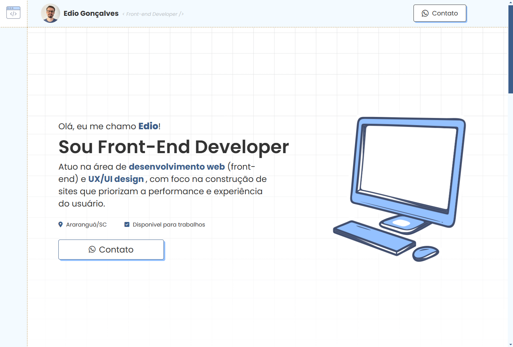

# Projeto de Website Responsivo - Portfólio Pessoal

Este repositório contém o código-fonte de um portfólio pessoal desenvolvido com **HTML** e **SASS**. O objetivo principal deste projeto é apresentar minhas habilidades como desenvolvedor front-end, destacando a implementação de layouts responsivos e estilizações avançadas utilizando SASS.



## Tecnologias Utilizadas

- **HTML5**: Para a estruturação semântica do conteúdo.
- **CSS3/SASS**: Para estilização avançada e organização modular dos estilos.

## Funcionalidades

- **Layout Responsivo**: O site se adapta perfeitamente a diferentes dispositivos, de desktops a smartphones.
- **Estilização com SASS**: Utilização de pré-processadores para uma organização modular e reutilizável do CSS.
- **Animações e Transições**: Implementação de animações sutis para melhorar a experiência do usuário.

## Como Executar o Projeto

Siga os passos abaixo para rodar o projeto localmente:

1. Clone este repositório:

```bash
git clone https://github.com/Edio-Goncalves/edio-goncalves-dev
```

2. Navegue até o diretório do projeto:

```bash
cd edio-goncalves-dev
```

3. Abra o arquivo `index.html` no seu navegador preferido para visualizar a aplicação.
